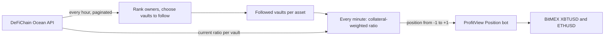

# vault-face: DeFiChain Vault-Following Signal Bot for ProfitView and BitMEX

A [ProfitView](https://profitview.net) signal bot that reads public lending-vault data from the DeFiChain blockchain, follows the vaults of the largest owners, and turns their collateral ratios into position signals for BitMEX perpetual futures. I built it in January 2025, partly to try AI-assisted development with DeepSeek in Cursor.

**Status:** experimental. The signal has not been backtested and has no performance record, so I make no claim that it is profitable.

## How it works

DeFiChain's lending vaults are public: anyone can read each vault's collateral, loans and collateral ratio from the Ocean API (`https://ocean.defichain.com/v0/mainnet/loans/vaults`). A user locks collateral in a vault and borrows DeFiChain tokens, such as DUSD, against it. Each vault's loan scheme sets a minimum collateral ratio, from 150% to 1000%, and a vault that falls below it is liquidated.

The bot treats the largest vault owners as potential "smart money" and reads their collateral ratios as a sentiment signal:

1. Every hour, fetch every vault, keep those with both loans and collateral, and keep the ones whose collateral includes an asset that has a BitMEX perpetual.
2. Rank owners by the total collateral across their vaults, and follow the top 10.
3. Every minute, fetch the followed vaults' current collateral ratios and average them for each asset, weighted by collateral value.
4. Map the average to a position between -1 (fully short) and +1 (fully long), and send it to ProfitView with `self.signal(...)`.

| Weighted collateral ratio | Position |
| --- | --- |
| Below 150%: vaults close to liquidation | -1 (fully short) |
| 150% to 200% | Linear from -1 to +1, neutral at 175% |
| Above 200%: vaults comfortably collateralised | +1 (fully long) |

ProfitView turns the position into BitMEX orders, within the position limit set for the bot. In practice only BTC and ETH are both DeFiChain collateral and BitMEX perpetuals, so the bot trades XBTUSD and ETHUSD.



## Repository contents

- [`src/VaultFollow.py`](src/VaultFollow.py): the ProfitView signal bot.
- [`src/vault-face.ipynb`](src/vault-face.ipynb): the notebook I used to explore the data and develop the logic. It runs against the live API.
- [`tests/`](tests): offline tests for the bot.
- [`.github/workflows/ci.yml`](.github/workflows/ci.yml): compiles the bot and runs the tests on every push and pull request.

## Running it

**Notebook.** It needs only `requests` and Jupyter. It makes read-only calls to a public API, so no keys are involved:

```bash
pip install requests jupyter
jupyter notebook src/vault-face.ipynb
```

Fetching every vault takes about 80 seconds, because the API returns 30 vaults per page.

**Bot.** The bot runs inside ProfitView, which provides the `profitview` module:

1. Open ProfitView's Signals IDE and create a file containing [`src/VaultFollow.py`](src/VaultFollow.py). The runtime loads its `Signals` class.
2. Set it up as a Position bot for XBTUSD and ETHUSD on BitMEX, with `max_position_size` set. A signal of +1 means a long position of that size, and -1 a short position of that size.

**Tests.** They run offline, replacing the `profitview` module and the DeFiChain API with small fakes:

```bash
pip install -r requirements.txt
pytest
```

## Design notes

- **Two schedules.** The list of vaults to follow is rebuilt every hour, because fetching every vault takes over a minute. The followed vaults' current ratios are read every minute.
- **Complete data only.** ProfitView runs scheduled tasks in background threads, so the hourly refresh builds the new list separately and swaps it in only when it is complete. If a refresh fails, the bot keeps the previous list.
- **Failures are skipped, not fatal.** Every request has a timeout. A vault that can't be fetched (for example, one closed since the last refresh) or that reports a ratio of -1 (the API's value when it has no usable ratio) is left out of that minute's average. An asset with no usable vaults gets no signal.
- **Owner totals.** Owners are ranked by the total collateral across their distinct vaults, so a vault holding both BTC and ETH counts once.

## Limitations and next steps

- **No evidence of edge.** The signal hasn't been backtested and there's no performance record. The project demonstrates the data pipeline and the ProfitView integration, not a proven strategy.
- **One vault can dominate.** Weighting by collateral lets a single heavily over-collateralised vault set the signal. In October 2026, one vault with a ratio of 8,065% held about 95% of the collateral in the followed BTC and ETH vaults, so both signals sat at fully long.
- **Fixed thresholds.** The 150% and 200% thresholds apply to every vault, but each loan scheme has its own minimum ratio, from 150% to 1000%. Measuring each vault against its own minimum would be more meaningful.
- **A small, shrinking sample.** In January 2025, 402 vaults had both loans and collateral. In October 2026, 158 did, and only 5 of those held BTC or ETH.
- **Next steps:** backtest against historical vault snapshots, measure ratios against each vault's loan-scheme minimum, cap any single vault's weight, and add risk limits beyond ProfitView's position sizing.

## How it was built: DeepSeek in Cursor

I wrote the first version in a morning, using the DeepSeek-V3 model in [Cursor](https://www.cursor.com/). Until then I had mainly used Claude 3.5 Sonnet and GPT-4o, and I wanted to see how DeepSeek compared.

My first attempt at fetching vault data made a single request:

```python
import requests

vaults_url = "https://ocean.defichain.com/v0/mainnet/loans/vaults"

response = requests.get(vaults_url)
all_vaults = response.json()["data"]

active_vaults = [
    vault for vault in all_vaults
    if float(vault.get("loanValue", 0)) > 0 and float(vault.get("collateralValue", 0)) > 0
]
```

It found only two vaults with loans and collateral, holding about $100 between them. I selected the code in Cursor, pressed Ctrl-K and asked DeepSeek to "Improve this code", and it proposed a substantial rewrite. Because the notebook only made read-only calls to a public API (no keys, no orders), I ran DeepSeek's rewrite before reading it closely, and went back to other work while it ran. When I came back to the notebook about ten minutes later, it had finished: 11,372 vaults in total, 402 of them with both loans and collateral.

My code had fetched only the first page of results. DeepSeek had added pagination:

```python
def fetch_all_vaults(vaults_url):
    params, all_vaults = {"size": 100}, []

    while True:
        response = requests.get(vaults_url, params=params)
        if response.status_code != 200:
            print(f"Failed to fetch vault data: {response.status_code}, {response.text}")
            return None

        data = response.json()
        all_vaults.extend(data["data"])
        if "page" not in data or not data["page"].get("next"):
            break
        params["next"] = data["page"]["next"]

    return all_vaults
```

I then reviewed and adapted the code before it went into the trading bot. The bot's current version also sets request timeouts and keeps its previous data if a refresh fails.

The most useful thing the assistant did was find a problem I hadn't noticed, rather than just tidy the code I already had. Deciding what the signal should mean, and checking what went into the trading path, stayed with me.

## History

- **January 2025:** built and deployed through ProfitView to BitMEX's Bot Creator beta, as a [BTC bot](https://www.bitmex.com/app/trade/XBTUSD?botId=58a12c25-5f3c-4908-bd4f-eb3f0ccdcad5&action=share) and an [ETH bot](https://www.bitmex.com/app/trade/ETHUSD?botId=3023d6ed-f9bf-4b6a-a664-699ae85cfb0a&action=share). Viewing them requires access to the beta.
- **October 2026:** revisited the code. I fixed an indentation error that stopped the published file from compiling, ranked owners by their total collateral rather than their first vault, made the hourly refresh and the HTTP error handling robust (see [Design notes](#design-notes)), and added tests and CI.

## License

MIT; see [LICENSE](LICENSE).
